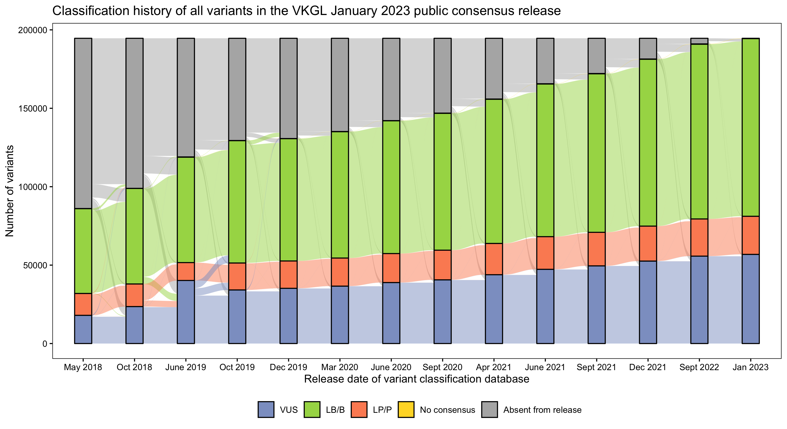
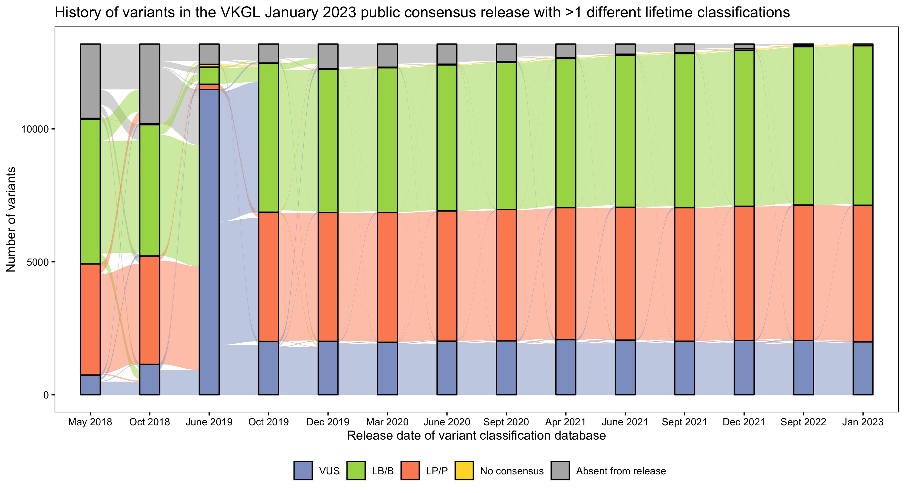
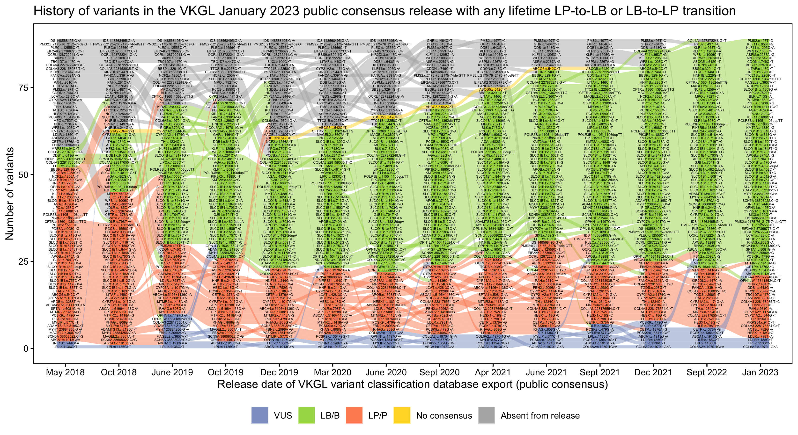

# vkgl-history-analytics
Parse VKGL variant classification history (using public releases), connect the variants and plot the results across time.
Some examples:

_Complete history of all variants in January 2023 release:_

_History of variants in January 2023 release with more than one lifetime classification:_ 

_History of variants in January 2023 release that have received both LP and LB during their lifetime:_

