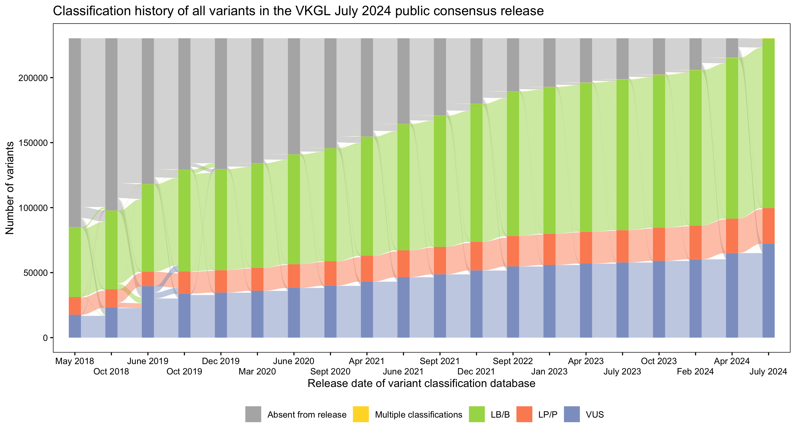
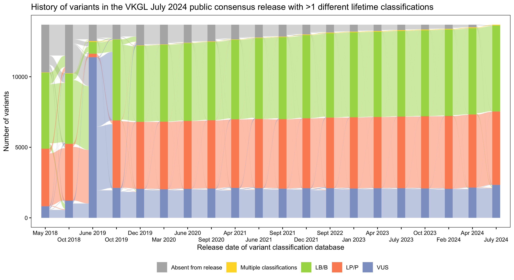
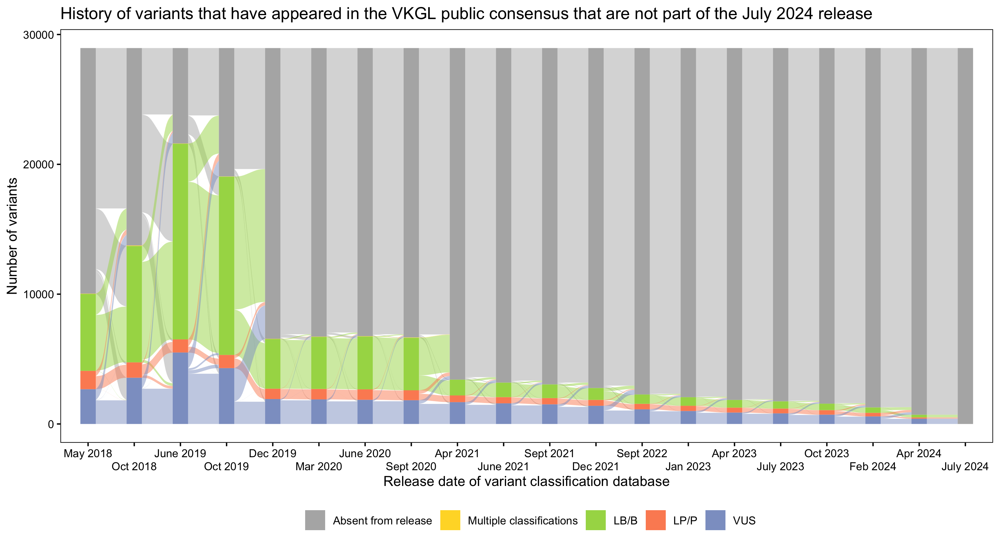
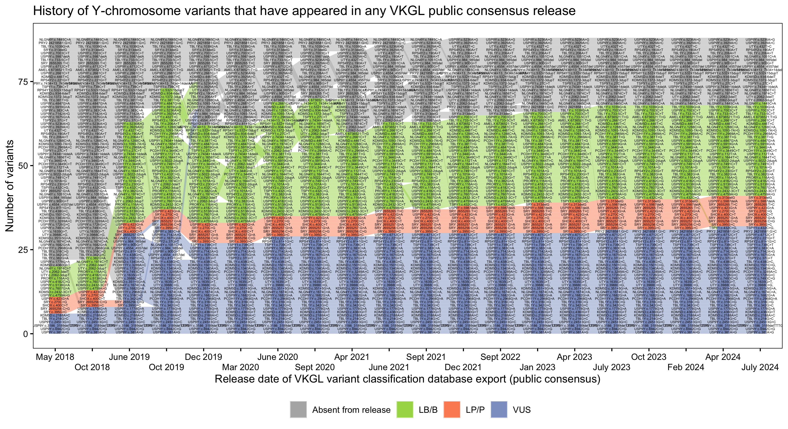
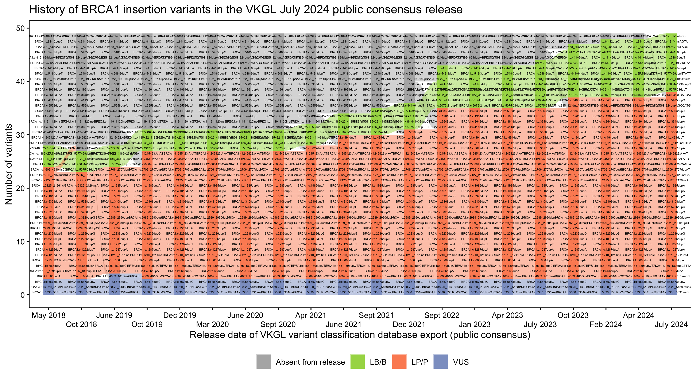

# vkgl-history-analytics
A tool that parses VKGL variant classification data from public releases, connects variants across time and provides insights by visualizing different aspects as [alluvial diagrams](https://en.wikipedia.org/wiki/Alluvial_diagram).
Please cite [Fokkema et al. 2019](https://doi.org/10.1002/humu.23896).

## Overview visualizations

## Examples of visualizations for specific chromosomes, genes or variant consequences

