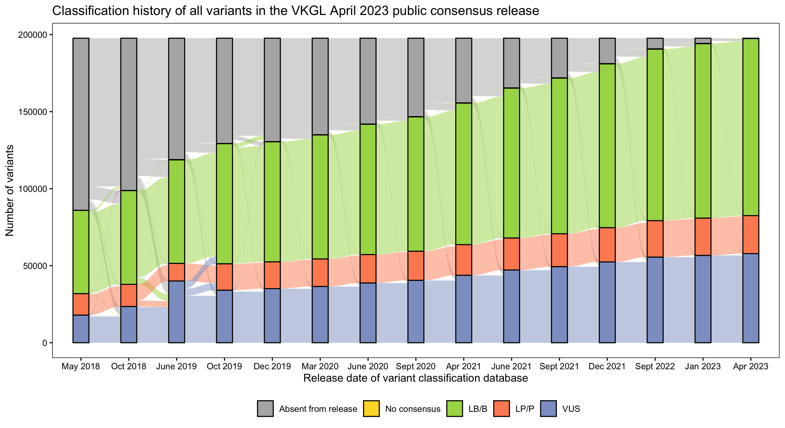
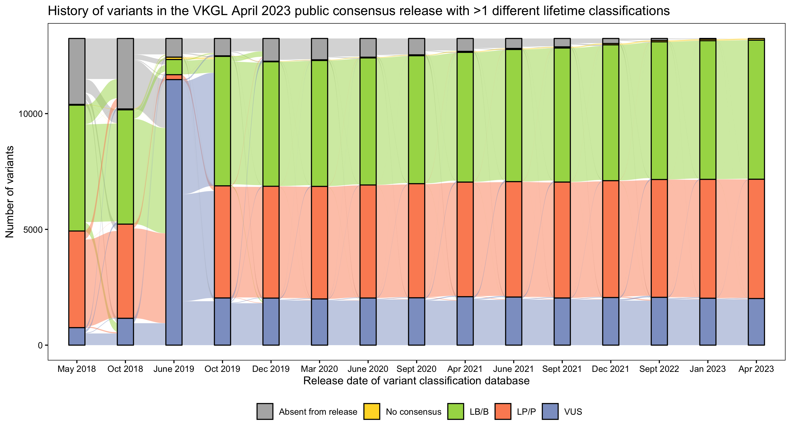
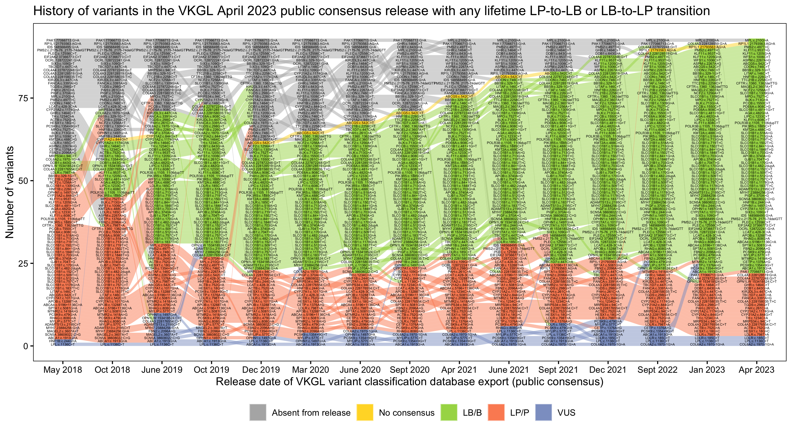
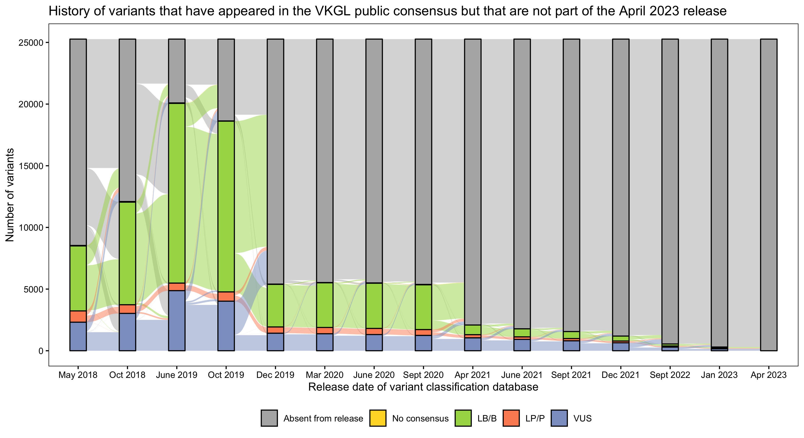
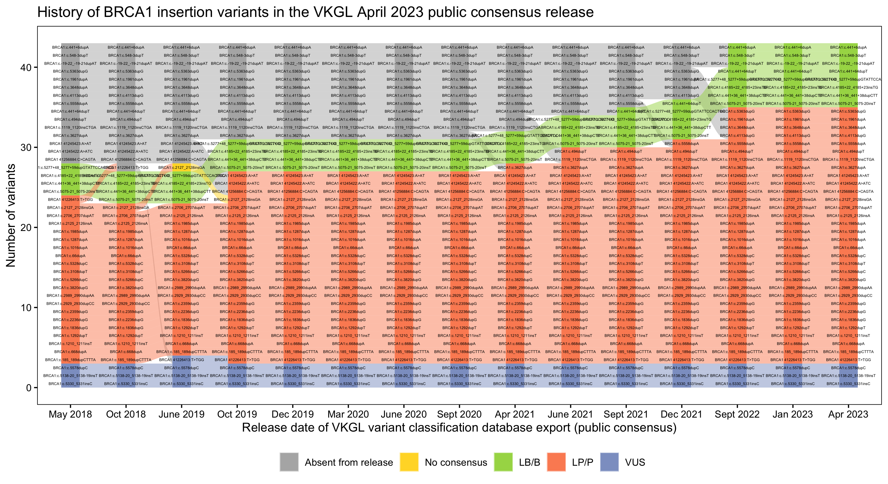

# vkgl-history-analytics
A tool that parses VKGL variant classification data from public releases, connects variants across time and provides insights by visualizing different aspects.
Please cite [Fokkema et al. 2019](https://doi.org/10.1002/humu.23896).

